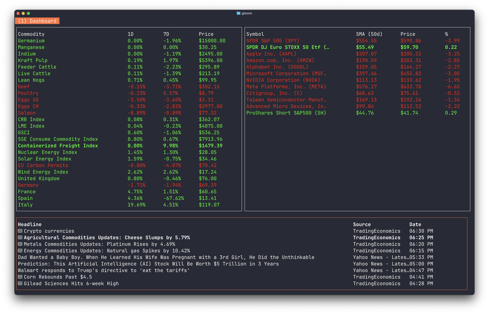

# gloom - a CLI financial terminal



Gloom is an open-source financial terminal designed to provide users with powerful tools for financial analysis and data visualization. Key features include:

## Features

- **News Aggregation**: Utilize Google Gemini to scrape all RSS news articles and read them in one place.
- **Stock Search:** Find new stocks to monitor with an easy-to-use search feature.
- **Open Source**: Fully open-source and customizable to suit your needs, view the [default configuration](./internal/utils/config/init.lua) to get started.

## Configuration

Gloom uses a Lua configuration file located at `$HOME/.config/gloom/init.lua`. You can configure the behavior of the app using this file. A default config file with documentation can be found [here](./internal/utils/config/init.lua).

### API Keys

Configure your API keys in the Lua config file:

```lua
gloom.api_keys = {
    {
        name = "gemini",
        key = os.getenv("GEMINI_KEY") -- or use a plain string
    },
    {
        name = "fmp", 
        key = os.getenv("FMP_KEY") -- or use a plain string
    }
}
```

### Required API Keys

| API Key | Description |
| ------- | ----------- |
| **Gemini** | API Key for using Google Gemini to web scrape articles |
| **FMP** | [FinancialModelingPrep](https://site.financialmodelingprep.com/) API Key, used for stock search |

### SSH Server (Optional)

The SSH server settings are still managed via environment variables:

| Variable Name | Description |
| ------------- | ----------- |
| `SSH_HOST` | URL to expose the SSH server (optional) |
| `SSH_PORT` | Port to expose the SSH server (optional) |

**NOTE:** The `SSH_HOST` and `SSH_PORT` variables are _optional_. When not set, the application will run as a local application in the terminal you created the process in.

## Building from Source

1. Clone the repository:
   ```bash
   git clone https://github.com/akayy-dev/gloom.git
   ```
2. Install dependencies:
   ```bash
   cd gloom
   go mod tidy
   ```
3. Create your configuration file:
   ```bash
   mkdir -p ~/.config/gloom
   cp internal/utils/config/init.lua ~/.config/gloom/init.lua
   ```
4. Edit the configuration file with your API keys and preferences
5. Compile and run the application:
   ```bash
   go build -o gloom ./cmd/ui
   ./gloom
   ```