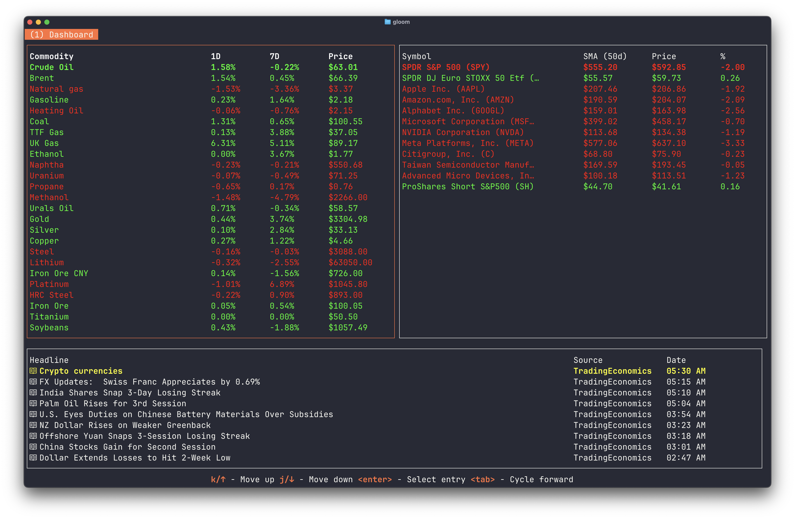

# gloom - a CLI financial terminal



Gloom is an open-source financial terminal designed to provide users with powerful tools for financial analysis and data visualization. Key features include:

## Features

- **Real-time Market Data**: Access live market data for stocks, commodities, and more.

- **News Aggregation**: Utilize Google Gemini to scrape all RSS news articles and read them in one place.

- **Open Source**: Fully open-source and customizable to suit your needs, view the [default configuration](./internal/shared/config/default.json) to get started.

## Environment Variables
To run Gloom, you need to set the following environment variables:

| Variable Name | Description                                            |
|---------------|--------------------------------------------------------|
| `GEMINI_KEY`  | API Key for using Google Gemini to web scrape articles |
| `SSH_HOST`    | URL to expose the SSH server (optional                 |
| `SSH_PORT`    | Port to expose the SSH server (optional)               |

Make sure to set these variables in your environment before starting the application.

**NOTE:** The `SSH_HOST` and `SSH_PORT` variables are *optional*, when not set
the application will run as a local application in the terminal you created the
process in.

## Getting Started

1. Clone the repository:
    ```bash
    git clone https://github.com/akayy-dev/gloom.git
    ```
2. Install dependencies:
    ```bash
    cd gloom
    go mod tidy
    ```
3. Set the required environment variables.
4. Start the application:
    ```bash
    go run ./cmd/ui
    ```

# Configuration
You can configure the behavior of the app using a `config.json` file. Gloom searches in `$HOME/.config/gloom/` for the config file. A default config file can be found [here](./internal/shared/config/default.json)
